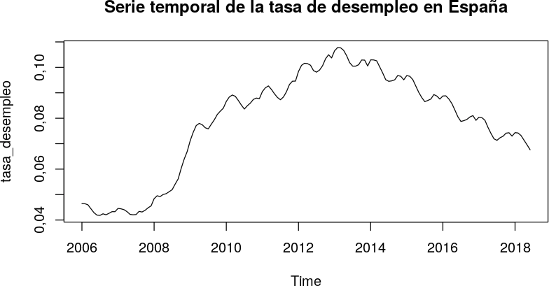

## Predicción de la tasa de desempleo nacional (España).
### Series temporales. Método ARIMA

Este cuaderno se ha elaborado en R. Dentro del cuaderno se describe el fundamento teórico de este método.

